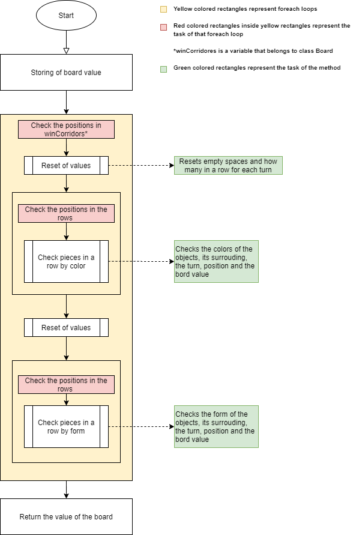
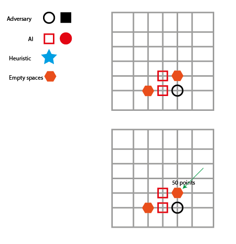
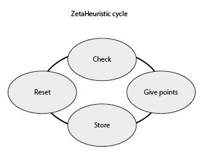

# IA_Project_01 - ZetaAI

**Ana Dos Santos** - a21900297 [AnSantos99](https://github.com/AnSantos99)

**André Vitorino**  - a21902663 [Freeze88-2](https://github.com/Freeze88-2)

**Catarina Matias** - a21801693 [StarryNight00](https://github.com/StarryNight00)

## Github Repository

<https://github.com/Freeze88-2/LP2_P1.git>

## Tasks of each group member

### Ana Dos Santos

Solution Brainstorming, Heuristic refinement

### André Vitorino

AI programming and algorithm implementation, Heuristic refinement, Solution brainstorming

### Catarina Matias

Primary Heuristic, Solution brainstorming

## Architecture

### Introduction

In our project, we implemented a `NegaMax` algorithm with alpha-beta cuts.
In the first phase, we implemented the NegaMax algorithm simply using
`NegativeInfity` and `PositiveInfinity` to classify each `board`, a test
placement by the algorithm of a piece on the game board, but with no
heuristic that could help it discern a good form a bad placement. We decided to
start with this small step to make sure the loops were running correctly and
to get better acquainted with the project and the class discussed materials.
When all loops were running as intended, we implemented the primary heuristic,
as described in the next chapter “Heuristic”. Then we added alpha-beta cuts to
the NegaMax algorithm, both as an improvement of the code and as an optimization.
Finally, the heuristic was perfected up until the conclusion of the project.

### Describing search algorithm

The `NegaMax` algorithm starts by making sure there wasn’t a `CancellationToken`
requested, which, in case there was, it will return `NoMove`
[the algorithm won’t return any piece placement] and a `value` of 0 since there
isn’t a `board` with a positive nor a negative value. It also checks for a
winner at the current board, and if there is, it returns a positive or negative
value of the `winScore` variable [which substitutes the `NegativeInfity` and
`PositiveInfinity` of the simpler loop with a `float` number] that in itself
just indicates whether or not the algorithm won, along with the `NoMove`
indication, the same as the `CancellationToken` explained before.

Then, there’s a depth verification [a `depth` is a sort of “inspection-level”
where the algorithm checks for a good piece placement on the current `board`.
On the first level, it looks into its own moves; but on the second, it will
look into the adversary’s level and their possible response moves, assuming it
uses the same heuristic; and so on it intercalates between players until
`maxDepth` is achieved]. Here, the `depth == maxDepth` verifies “is the current
depth value the same value as the set maximum depth?”, which allows us to
control and limit the `NegaMax` method. Since it is assumed in the code that the
first `depth` is the position 0, this way the algorithm won’t look a depth
further than set [eg: if `maxDepth` was 5, without this verification, the last
depth would be 6; even if small, such difference could make it harder to spot
bugs or errors and the time constraint could go over the limit. When limited,
the code would receive a 5, but it’s already the sixth time the algorithm would
be running, so the values are returned with a `NoMove` order that allows for the
upper part of the code to read the `bestMove` discerned through the last runs].

### Heuristic

The heuristic in this project has the task to check out the values of the board
and its objects. By that, ZetaHeuristic has 4 specific tasks. Those tasks
are divided in the following way:

-The Research of positions in rows
-Resetting of values
-Checking Objects by its colour
-Checking Objects by its form

Before going deeply into the explanation of each tasks, it's important to know
that this Heuristic works by checking its surroundings and setting values that
depend on the turn and position also by form and colour of the objects.
It also resets all values except the value of the actual board the difference
being that after reseting, instead of checking the colour it will check the
form and so on.

The following flowchart represents the functionality of this heuristic where
the first step is the storing of the current board values and after that the
AI goes through various positions in the board to check the states of it
(in this case if there are any objects or empty spaces).

As mentioned, ZetaHeuristic starts by checking first if there is an object in a
current position. If that’s the case, next comes the verification of the colour
of that object in that position. If the object is the same colour as the colour
of the current player then there is going to be an addition of 1 doing the same
for the next coming pieces that are going to come.

In case the next piece is not of it’s color or shape (depending on what is checking
at the time) it resets the number to 0 and starts counting the other player.

In the following example the Heuristic is checking first if there is and objects
in the current position. Since there is one, the Heuristic is checking what
colour that object has. Since the colour is equal to last turns colour there
is an the addition of 1 for the upcoming pieces.

In other scenarios in case there is non-existent piece in the beginning, middle
or in the end of a line, that/those position/s will be saved/stored for later
when the line reaches its limits or has two empty spaces. That will be verified
like this:

-If there is a empty space that has an piece underneath which means there is a
possibility to put another piece above that piece in the next turn, he gets
50 point for the next piece in that position.

This means that this Heuristic depends on giving values to the pieces depending
on the best possible move so if there is a possibility on winning ZetaHeuristic
will keep on adding points to the pieces that land on that favourable position.
The better the position and amount in row the more points and, the less
favourable position and amount in row the less the points. After that the whole
cycle starts again but this time instead of checking the colours it will check
the form of the objects.

## References

The following references where used during this project.

**[1]** Class Power-points

**[2]** http://blog.gamesolver.org/

**[3]** https://docs.microsoft.com/en-us/dotnet/api/

**For Diagrams and FlowCharts:**

**[1]** The following site was used for both flowchart and UML class diagram.
<https://www.draw.io/>
