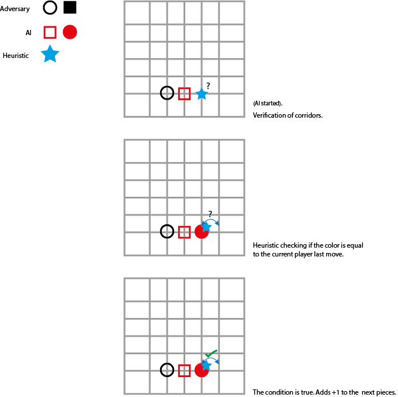

# IA_Project_01 - ZetaAI

**Ana Dos Santos** - a21900297 [AnSantos99](https://github.com/AnSantos99)

**André Vitorino**  - a21902663 [Freeze88-2](https://github.com/Freeze88-2)

**Catarina Matias** - a21801693 [StarryNight00](https://github.com/StarryNight00)

## Github Repository

<https://github.com/Freeze88-2/LP2_P1.git>

## Tasks of each group member

### Ana Dos Santos

Solution Brainstorming, Heuristic refinement

### André Vitorino

AI programming and algorithm implementation, Heuristic refinement, Solution brainstorming

### Catarina Matias

Primary Heuristic, Solution brainstorming

## Architecture

### Introduction

### Describing search algorithm

### Heuristic

The heuristic in this project has the task to check out the values of the board and its objects. By that, ZetaHeuristic has 4 specific tasks. Those tasks are divided in the following way:

-The Research of positions in rows
-Resetting of values
-Checking Objects by its colour
-Checking Objects by its form

Before going deeply into the explanation of each tasks, it's important to know that this Heuristic works by checking its surroundings and setting values that depend on the turn and position also by form and colour of the objects. It also resets all values except the value of the actual board the difference being that after reseting, instead of checking the colour it will check the form and so on.
The following flowchart represents the functionality of this heuristic where the first step is the storing of the current board values and after that the AI goes through various positions in the board to check the states of it (in this case if there are any objects or empty spaces).

As mentioned, ZetaHeuristic starts by checking first if there is an object in a current position. If that’s the case, next comes the verification of the colour of that object in that position. If the object is the same colour as the colour of the current player then there is going to be an addition of 1 doing the same for the next coming pieces that are going to come.

In case the next piece is not of it’s color or shape (depending on what is checking at the time) it resets the number to 0 and starts counting the other player.

In the following example the Heuristic is checking first if there is and objects in the current position. Since there is one, the Heuristic is checking what colour that object has. Since the colour is equal to last turns colour there is an the addition of 1 for the upcoming pieces.

In other scenarios in case there is non-existent piece in the beginning, middle or in the end of a line, that/those position/s will be saved/stored for later when the line reaches its limits or has two empty spaces. That will be verified like this:

-If there is a empty space that has an piece underneath which means there is a possibility to put another piece above that piece in the next turn, he gets 50 point for the next piece in that position.

This means that this Heuristic depends on giving values to the pieces depending on the best possible move so if there is a possibility on winning ZetaHeuristic will keep on adding points to the pieces that land on that favourable position. The better the position and amount in row the more points and, the less favourable position and amount in row the less the points. After that the whole cycle starts again but this time instead of checking the colours it will check the form of the objects.

## References

The following references where used during this project.

**[1]** Class Power-points

**[2]** http://blog.gamesolver.org/

**[3]** https://docs.microsoft.com/en-us/dotnet/api/

**For Diagrams and FlowCharts:**

**[1]** The following site was used for both flowchart and UML class diagram.
<https://www.draw.io/>
